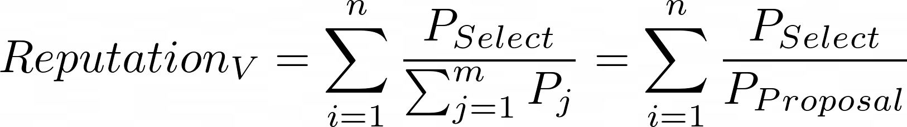
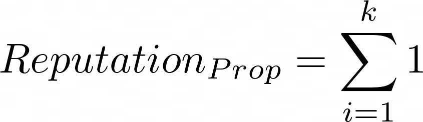

## Reputation

Members get reputation by do one of these actions: 

1. Vote
2. Create proposals

⚠️ Only executed proposals are counted

### Vote

* `P` = Power
* `n` = Number of votes
* `m` = Number of choices

### Proposal

* `k` = Number of proposed items